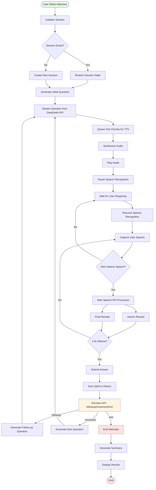
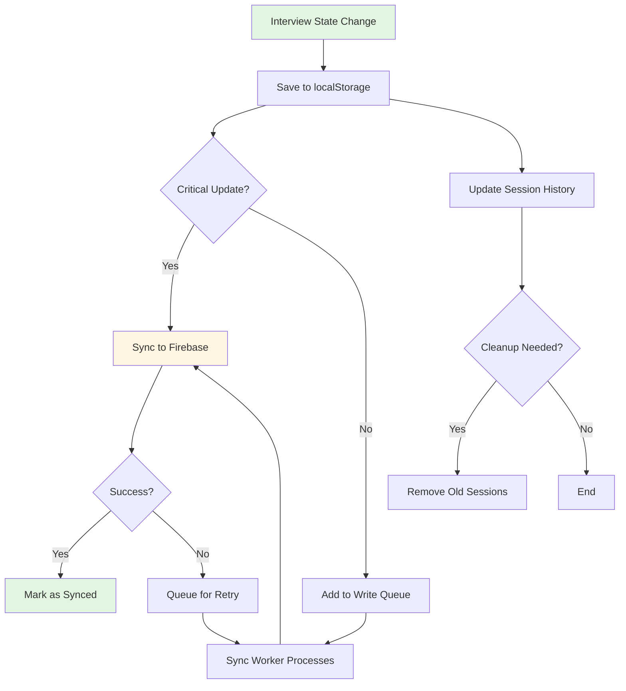

# AI Interviewer Standalone Client - Architecture Document

## Overview

The AI Interviewer Standalone Client is a React-based TypeScript application that conducts AI-powered interviews entirely on the client side. The application integrates speech-to-speech (STS) capabilities, text-to-speech synthesis, and real-time interview management without requiring server-side processing during the interview session.

## System Architecture

### High-Level Architecture

The application follows a client-side architecture pattern with the following characteristics:

- **Client-Only Interview Execution**: All interview logic runs in the browser without server calls during active sessions
- **Local-First Storage**: Interview sessions stored in localStorage with background synchronization to Firebase
- **Streaming AI Integration**: Direct integration with DeepSeek API via Lambda proxy for question generation and analysis
- **Real-Time Speech Processing**: Browser-based speech recognition and text-to-speech synthesis

### Technology Stack

- **Frontend Framework**: React 19.2.3 with TypeScript
- **Build Tool**: Vite 7.2.4
- **Routing**: React Router DOM 7.10.1
- **Styling**: Tailwind CSS 4.1.18
- **Speech Recognition**: Web Speech API with custom STS logic
- **Text-to-Speech**: Piper TTS via @mintplex-labs/piper-tts-web
- **AI Integration**: DeepSeek API through Lambda proxy
- **Storage**: localStorage with Firebase Firestore synchronization
- **Analytics**: Google Analytics 4 and Mixpanel

## Core Components

### Application Structure

```
src/
├── pages/              # Route-level page components
├── components/         # Reusable UI components
├── services/           # Business logic and API services
├── hooks/              # Custom React hooks
├── models/             # TypeScript type definitions
├── utils/              # Utility functions and STT logic
├── lib/                # Third-party library configurations
└── workers/            # Web Workers for background processing
```

### Page Components

**Home.tsx**: Landing page with authentication guard

**SelfApply.tsx**: Interview configuration interface
- User email verification
- Job selection or custom job creation
- Interview parameters configuration (language, difficulty, time, examination points)
- Piper TTS initialization

**Interview.tsx**: Main interview execution interface
- Real-time interview conversation
- Speech recognition and TTS integration
- Video animation state management
- Session persistence and recovery

**Results.tsx**: Interview results display
- Summary and scoring
- Strengths and improvement areas
- Historical session access

### Service Layer

#### Interview Engine (`services/interview/`)

**InterviewStateManager**: Core interview orchestration
- Session lifecycle management
- Phase transitions (introduction, project, technical)
- Question generation coordination
- Answer analysis and decision making
- Feedback generation
- Interview summarization

**PromptBuilder**: AI prompt construction
- Dynamic prompt generation based on interview state
- Context-aware question formulation
- Feedback and summary prompt assembly

#### API Services (`services/api/`)

**DeepSeekApi**: Lambda proxy integration
- Streaming question generation
- Decision making (followup/movenext/end)
- Feedback generation
- Interview summarization

**ServerApi**: Backend API integration
- User verification
- Job listing and retrieval
- Authentication token management

#### Storage Services (`services/storage/`)

**InterviewStorage**: Local storage management
- Session persistence in localStorage
- Session history management
- Automatic cleanup of old sessions
- Session recovery from localStorage

**FirebaseStorage**: Cloud synchronization
- Firestore document creation and updates
- Session recovery from cloud
- User document management

**SyncManager**: Background synchronization
- Priority-based write queue
- Automatic retry on failure
- Sync status tracking
- Critical vs normal write classification

**SyncWorker**: Background sync processing
- Queue processing
- Rate limiting
- Error handling and retry logic

### Custom Hooks

**useInterview**: Interview state management hook
- Message history management
- Question/answer flow coordination
- Timer management
- Completion handling

**useScreenWakeLock**: Screen wake lock management
- Prevents screen sleep during interviews
- Automatic cleanup on unmount

**usePageTracking**: Analytics integration
- Page view tracking
- Event tracking coordination

## Speech-to-Speech (STS) Layer

The STS layer orchestrates the complete speech-to-speech pipeline, enabling natural conversation flow between the AI interviewer and the user without manual intervention.

### STS Architecture Overview

The STS pipeline consists of four main stages:

1. **Speech Input (STT)**: User speech captured via microphone
2. **Text Processing**: Transcript analyzed and processed
3. **AI Response**: Question/feedback generated via DeepSeek API
4. **Speech Output (TTS)**: AI response synthesized and played

### Speech-to-Text (STT) Component

#### ResetSTTLogic (`utils/stt/sttLogic.ts`)

**Core Functionality**:
- Wraps Web Speech API with advanced session management
- Maintains continuous recognition with automatic restart mechanism
- Preserves transcript across recognition restarts
- Handles interim and final results with intelligent merging

**Auto-Restart Mechanism**:
- Automatic restart every 30 seconds of cumulative microphone time
- Prevents Web Speech API timeout issues
- Preserves transcript before restart: `transcriptBeforeRestart + currentTranscript`
- Session ID tracking for restart metrics
- Graceful stop/start sequence with event synchronization

**Transcript Management**:
- **Interim Results**: Continuously updated as user speaks
- **Final Results**: Committed when speech recognition confirms completion
- **Interim Auto-Save**: Saves interim results every 5 seconds to prevent loss
- **Repeat Collapse**: Detects and removes repeated words/phrases using LPS algorithm
- **Word Tracking**: Maintains array of heard words for real-time updates

**Session Lifecycle**:
- **Start**: Initializes recognition, starts mic timer, clears or preserves transcript
- **Active**: Processes results, updates transcript, tracks mic time
- **Restart**: Buffers current transcript, stops recognition, restarts with new session ID
- **Stop**: Stops recognition, finalizes transcript, clears timers

**Error Handling**:
- Auto-recovery on `no-speech`, `audio-capture`, `network` errors
- Retry logic with 500ms delay
- Abort handling during restart sequences
- Event listener cleanup on destroy

#### VADController (`utils/stt/vadController.ts`)

**Voice Activity Detection**:
- Uses `@ricky0123/vad-web` library with ONNX Runtime
- Detects speech start/end events in real-time
- Configurable minimum speech duration (default: 200ms)
- ONNX WASM models served from local `/ort/` path

**Integration Points**:
- Speech start callback: Triggers visual feedback
- Speech end callback: Provides audio buffer for processing
- Error handling: Logs and propagates VAD errors
- Lifecycle: Start/pause/destroy methods for resource management

**Configuration**:
- Base asset path: CDN for VAD models
- ONNX WASM path: Local server for WebAssembly files
- Auto-start: Configurable start-on-load behavior

#### useSpeechRecognition Hook

**STS Coordination**:
- Manages STT lifecycle within React component context
- Integrates silence detection (1.5s timeout) for automatic submission
- Coordinates with TTS: pauses STT during AI speech, resumes after
- Permission management: Requests and tracks microphone access

**Silence Detection Logic**:
- 1.5 second timeout after final transcript received
- Automatically submits transcript when silence detected
- Clears transcript after submission
- Resets timer on new speech activity

**TTS Coordination**:
- `pauseListening()`: Stops STT when TTS starts speaking
- `resumeListening()`: Restarts STT after TTS completes
- Resume flag ensures microphone reactivates after first question
- 100ms delay on resume for stability

### Text-to-Speech (TTS) Component

#### Piper TTS Integration (`lib/piper.ts`)

**ONNX Runtime Setup**:
- ONNX Runtime configured before Piper import
- SharedArrayBuffer support required (secure context)
- WASM files served from local `/ort/` endpoint
- CDN URL patching for broken piper-tts-web dependencies

**Voice Model Management**:
- **Caching**: Voice models cached in browser IndexedDB
- **Download**: Automatic download on first use with progress tracking
- **Warm-up**: Pre-synthesis test to reduce first-utterance latency
- **Recovery**: Corrupt cache detection and automatic re-download
- **Backend State**: Tracks ORT readiness, voice loading, warm-up status

**Streaming Synthesis Pipeline**:

1. **Text Queue**: Sentences queued as they arrive from AI stream
2. **Synthesizer Worker**: 
   - Processes sentences sequentially
   - Converts text to WAV audio blobs via ONNX model
   - Tracks synthesis time per sentence
   - Maintains max 4 audio chunks in queue
3. **Player Worker**:
   - Decodes WAV blobs to AudioBuffer
   - Plays via Web Audio API
   - Tracks playback completion
   - Handles chunk timeouts (2s + audio duration)

**Sentence Boundary Detection**:
- Splits text on punctuation (`.`, `?`, `!`, `,`)
- Processes complete sentences for natural speech flow
- Buffers incomplete sentences until boundary found
- Force-break at 500 characters to prevent excessive buffering

**Audio Queue Management**:
- SimpleQueue implementation with promise-based waiting
- Synthesizer blocks when queue full (4 chunks)
- Player processes queue sequentially
- Null sentinel signals end of stream

#### useStreamingTTS Hook

**Streaming Coordination**:
- Receives text chunks from AI response stream
- Buffers chunks until sentence boundaries detected
- Queues complete sentences for synthesis
- Processes queue sequentially to maintain order

**State Management**:
- **Text Buffer**: Accumulates chunks until sentence complete
- **TTS Queue**: Queue of sentences ready for synthesis
- **Current Chunk**: Text currently being synthesized/played
- **Completed Text**: Full text that has finished playing
- **Stream Complete**: Flag indicating all chunks processed

**Caption Display**:
- Shows current chunk text during streaming
- Updates to completed text when stream finishes
- Clears on new TTS session
- Supports real-time caption display during playback

**Lifecycle Hooks**:
- `onStartSpeaking`: Triggered when first chunk starts
- `onStopSpeaking`: Triggered when all chunks complete
- `onAudioStart`: Triggered when audio actually plays
- `onAudioStop`: Triggered when audio chunk finishes

### STS Flow Coordination

**Question → Answer Flow**:

1. **AI Question Generation**:
   - DeepSeek API streams question text
   - `useStreamingTTS.addChunk()` receives text chunks
   - TTS synthesizes and plays question
   - STT paused during TTS playback

2. **User Answer Capture**:
   - STT resumes after TTS completes
   - User speaks answer
   - VAD detects speech activity
   - Web Speech API generates interim/final transcripts
   - Silence detection (1.5s) triggers answer submission

3. **Answer Processing**:
   - Transcript sent to interview engine
   - Decision API determines next action
   - Next question generated if continuing
   - Cycle repeats

**Critical Timing**:
- **TTS → STT Transition**: 100ms delay ensures clean handoff
- **Silence Detection**: 1.5s timeout balances responsiveness and accuracy
- **STT Restart**: 30s mic time prevents API timeouts
- **Interim Save**: 5s interval prevents transcript loss

**Error Recovery**:
- STT errors trigger auto-restart with preserved transcript
- TTS errors log and continue with next chunk
- Network errors retry with exponential backoff
- Permission errors surface to user with clear messaging

## System Flow Diagrams

### Interview Execution Flow



### STS Pipeline Flow

```mermaid
flowchart LR
    subgraph Input["Speech Input Layer"]
        Mic[Microphone] --> VAD[VAD Controller]
        VAD -->|Speech Detected| STT[Web Speech API]
    end
    
    subgraph Processing["Text Processing Layer"]
        STT -->|Interim/Final| Transcript[Transcript Buffer]
        Transcript -->|1.5s Silence| Submit[Submit Answer]
        Submit --> Engine[Interview Engine]
    end
    
    subgraph Output["Speech Output Layer"]
        Engine -->|Question Stream| TTSBuffer[TTS Text Buffer]
        TTSBuffer -->|Sentence Boundary| Piper[Piper TTS]
        Piper -->|WAV Blob| AudioQueue[Audio Queue]
        AudioQueue -->|Playback| Speaker[Speaker]
    end
    
    Speaker -.->|Pause STT| STT
    Speaker -.->|Resume STT| STT
    
    style Mic fill:#e1f5e1
    style Speaker fill:#e1f5e1
    style Engine fill:#fff4e1
```



### Storage and Synchronization Flow



## Data Flow

### Interview Initialization Flow

1. User enters email on SelfApply page
2. Server API verifies user existence
3. User selects or creates job
4. Interview configuration set (time, language, difficulty, points)
5. Piper TTS voice model prepared and warmed
6. Session created with unique sessionId
7. Navigation to Interview page with sessionId

### Interview Execution Flow

1. **Kickoff**:
   - InterviewStateManager generates initial question
   - Question streamed via DeepSeek API
   - Chunks sent to TTS for synthesis
   - Question displayed and spoken

2. **Answer Processing**:
   - User provides answer (speech or text)
   - Answer added to QA history
   - Decision API determines next action (followup/movenext/end)
   - Counter logic applied for irrelevant answer handling
   - Next question generated if continuing
   - Feedback generated in background

3. **Phase Management**:
   - Phase transitions based on feedback analysis
   - Project tracking for dynamic phase progression
   - Question counts maintained per phase
   - Minimum question requirements enforced

4. **Completion**:
   - Interview summary generated
   - Results calculated and stored
   - Session marked as completed
   - Navigation to Results page

### Storage Flow

1. **Local Storage**:
   - Session saved to localStorage on each state change
   - History maintained with max 50 entries
   - Automatic cleanup of old synced sessions

2. **Firebase Sync**:
   - Background synchronization via SyncManager
   - Priority-based queue (critical vs normal)
   - Automatic retry on failure
   - Sync status tracked per field

3. **Recovery**:
   - Session recovery from localStorage
   - Cloud recovery for ongoing sessions
   - Automatic session restoration on page reload

## State Management

### Interview Session State

The `InterviewSession` model maintains:
- Session metadata (sessionId, userId, jobId, timestamps)
- QA history with scores and correctness
- Current phase and phase-specific counters
- Project tracking for dynamic transitions
- Remaining time and interview configuration
- Result data when completed

### State Persistence

- **Immediate**: Critical state changes saved to localStorage synchronously
- **Background**: Non-critical updates queued for Firebase sync
- **Recovery**: State restored from localStorage or Firebase on initialization

### State Transitions

- **Ongoing → Completed**: Triggered by time limit, explicit end, or decision logic
- **Phase Transitions**: Managed by feedback analysis and project completion
- **Counter Logic**: Tracks irrelevant answers and topic follow-ups for intelligent progression

## API Integration

### DeepSeek API (via Lambda Proxy)

**Endpoints**:
- Question generation (streaming)
- Decision making (followup/movenext/end)
- Feedback generation (JSON)
- Interview summarization (JSON)

**Configuration**:
- Temperature settings per operation type
- Response format specifications
- Streaming vs non-streaming modes
- Error handling and retry logic

### Server API

**Endpoints**:
- User verification (`GET /user/check`)
- User retrieval (`GET /user/:userId`)
- Job listing (`GET /job`)
- Job retrieval (`GET /job/:jobId`)

**Authentication**: Bearer token via environment variable

## Build Configuration

### Vite Configuration

**Custom Plugins**:
- ONNX Runtime file serving from node_modules
- Piper TTS CDN URL patching for local ORT files

**Optimization**:
- ONNX Runtime excluded from dependency optimization
- Assets inlining disabled for large files
- Path aliases configured (@ → src/)

**Development Server**:
- CORS headers for SharedArrayBuffer support
- Proxy configuration for DeepSeek API
- File system access for parent directories

### Environment Variables

- `VITE_API_BASE_URL`: Server API base URL
- `VITE_API_TOKEN`: Server API authentication token
- `VITE_DEEPSEEK_API_KEY`: DeepSeek API key (if direct access)
- `VITE_LAMBDA_API_URL`: Lambda proxy URL for DeepSeek
- `VITE_HUGGINGFACE_MODEL`: Model identifier for Lambda

## Security Considerations

- **Authentication**: Token-based API authentication
- **CORS**: Configured for required cross-origin requests
- **Local Storage**: Sensitive data stored with user consent
- **Firebase**: Secure rules for data access
- **API Keys**: Environment-based configuration

## Performance Optimizations

- **Lazy Loading**: Components loaded on demand
- **Code Splitting**: Route-based code splitting via Vite
- **Asset Optimization**: Large assets excluded from inlining
- **Caching**: TTS voice models cached in browser
- **Background Processing**: Non-critical operations queued
- **Video Preloading**: Animation videos preloaded for smooth transitions

## Error Handling

- **API Errors**: Retry logic with exponential backoff
- **Storage Errors**: Quota exceeded handling with cleanup
- **TTS Errors**: Corrupt cache detection and recovery
- **STT Errors**: Auto-restart on recognition failures
- **Network Errors**: Graceful degradation and retry

## Analytics Integration

- **Google Analytics 4**: Page views and custom events
- **Mixpanel**: User engagement tracking
- **Event Types**: Interview start, completion, abandonment, errors
- **Metrics**: Duration, question count, response times

## Browser Compatibility

- **Speech Recognition**: Web Speech API (Chrome, Edge, Safari)
- **SharedArrayBuffer**: Required for ONNX Runtime (requires secure context)
- **AudioContext**: Required for TTS playback
- **localStorage**: Required for session persistence

## Deployment

- **Build Command**: `npm run build`
- **Output**: Static files in `dist/` directory
- **Hosting**: Compatible with static hosting services
- **Environment**: Production environment variables required
- **HTTPS**: Required for SharedArrayBuffer support

